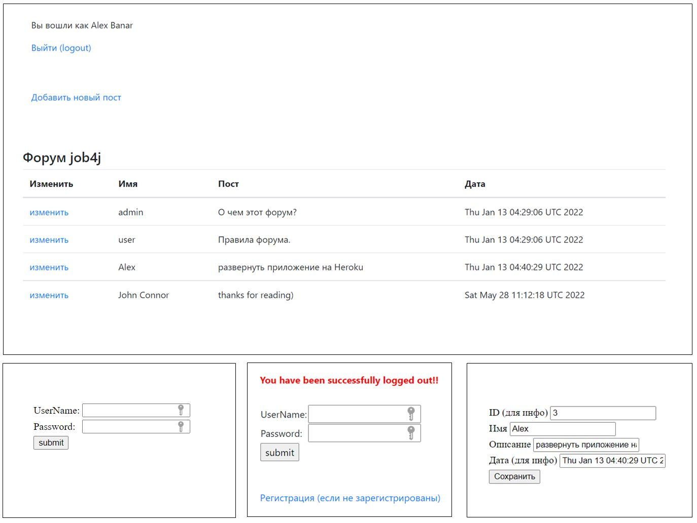

Technologies:

- Spring Boot
- Spring Boot Test
- Spring Data
- Spring Security
- Spring Security Test
- Spring Web
- PostgreSQL

Annotations:

- @ActiveProfiles
- @AutoConfigureMockMvc
- @Autowired
- @Bean
- @Configuration
- @Controller
- @EnableWebSecurity
- @Entity
- @GeneratedValue
- @GetMapping
- @Id
- @JoinColumn
- @ManyToOne
- @MockBean
- @ModelAttribute
- @PostMapping
- @RequestMapping
- @RequestParam
- @SpringBootApplication
- @SpringBootTest
- @Table
- @Test
- @WithMockUser

Description:

- A simple Spring Boot application that shows all posts of various registered users in a common table.

- It has 3 models: Post, User and Authority. As a minimum set of entities needed to run the chat. Spring Security provides functionality of authentication of users as well as registration.

- Controllers layer covers creation, edition of posts, their accumulation for the main (index) view as a table. No deletion function realized. Controllers talk directly to Repositories (Service layer was ommitted for simplicity). Repositories are interfaces that extend CrudRepository. ORM is provided in the Entities. Views are jsp with embedded jstl support.

- Tests (for Controllers) use mock objects mainly checking the returned status code and view name. The application is deployed at Heroku (see below the link).

Deployed:

- https://aqueous-fjord-48979.herokuapp.com/login

